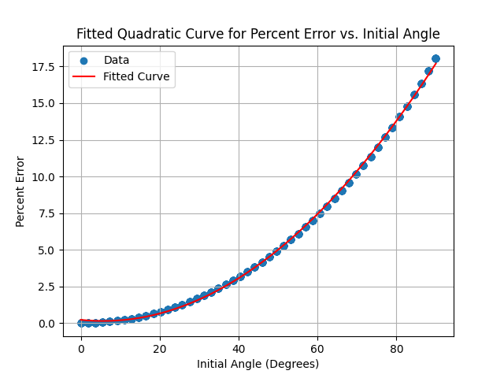

# Math IA Pendulum Graph
 Graph plot and visualisation of percentage error between approximated time period formula used in IB Physics and exact time period, against initial angle of bob.

## Files

- `pendulum.cpp`: C++ program that calculates the percentage error for different initial angles.
- `plot_pendulum_data.py`: Python script that reads the data generated by the C++ program and plots a graph.

## Usage

### C++ Program

Compile the C++ program:

```bash
g++ pendulum.cpp -o pendulum
```

Run the compiled program:
```bash
./pendulum
```

### Python Script
Ensure you have the required Python packages installed:
```bash
pip3 install numpy matplotlib scipy
```

Run the Python script to plot the data and fit a quadratic curve:
```bash
python3 plot_pendulum_data.py
```

## Results
The generated graph illustrates the relationship between the initial angle and the percentage error. A quadratic curve has been fitted to the data to capture the underlying trend.



## Fitted Equation
The fitted equation for the quadratic curve is:
$$ f(x) = 0.00246396 \cdot x^2 - 0.02765015 \cdot x + 0.22808328 $$

This equation can be used to predict the percentage error for a given initial angle.
